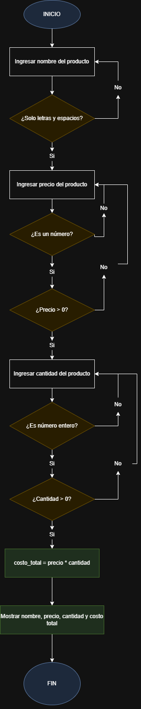

# Sistema de Inventario

Un programa simple en Python para registrar productos en un inventario, validando datos de entrada y calculando el costo total.

## Descripción

Este proyecto es un sistema básico de inventario que permite al usuario ingresar información de un producto (nombre, precio y cantidad) con validación de datos, y calcula automáticamente el costo total.

## Características

- **Validación de nombre**: Solo acepta letras y espacios
- **Validación de precio**: Solo acepta números decimales mayores que 0
- **Validación de cantidad**: Solo acepta números enteros mayores que 0
- **Cálculo automático**: Calcula el costo total (precio × cantidad) redondeado a 1 decimal
- **Manejo de errores**: Mensajes claros cuando se ingresan datos inválidos

## Instalación y uso del programa

1. Clona este repositorio:
```bash
1.1 Antes de clonar el repositorio; abrir la terminal; acontiuacion se dejaran una serie de comandos necesarios y paso a paso para poder ejecutar el programa correctamente (dependiendo del sistema operativo se deben usar distintos comandos en la terminal):

Windows
- Símbolo del sistema (CMD): Presiona Windows + R, escribe cmd y presiona Enter.

- Para acceder o posicionarte en una carpeta especifica ejecutar comando "cd (nombre de carpeta)"

MacOS
- Spotlight: Presiona "Comando + Espacio", "escribe Terminal" y "presiona Enter".

- Para acceder o posicionarte en una carpeta especifica ejecutar comando "cd (nombre de carpeta)"

Linux
- Atajo de teclado: Presiona "Ctrl + Alt + T" (funciona en la mayoría de distribuciones como Ubuntu).

- Menú de aplicaciones: Busca "Terminal" en el lanzador de aplicaciones.

- Para listar archivos en la terminal ejecutar el comando "ls" despues de haber ejecutado el comando, se debe visualizar todos los archivos y carpetas que estan en directorio actual.

- Para acceder o posicionarte en una carpeta especifica ejecutar comando "cd (nombre de carpeta)"

1.2 Ingresar este comando para poder clonar el repositorio git clone https://github.com/juanvargasviloria2507-gif/Proyecto-Inventario-python.git

Antes de poder clonar el repositorio y despues de haber accedido a la terminal ejecutar estos comandos (dependiendo nuestro sistema operativo) para poder listar o visualizar las carpetas o archivos que tienes en tu directorio actual (esto es importante porque queremos visualizar en que directorio o carpeta queremos clonar el repositorio; por ejemplo: Documentos, Escritorio, Descargas etc.).

Windows
- Para listar archivos en la terminal ejecutar el comando "dir" despues de haber ejecutado el comando, se debe visualizar todos los archivos y carpetas que estan en directorio actual. Despues de haber ejecutado ese comando ejecutamos este para que nos dirija o nos posicione a donde queremos colonar el repositorio "cd nombre del directorio o carpeta" por ejemplo: cd Documentos.

MacOS
- Para listar archivos en la terminal ejecutar el comando "ls" despues de haber ejecutado el comando, se debe visualizar todos los archivos y carpetas que estan en directorio actual. Despues de haber ejecutado ese comando ejecutamos este para que nos dirija o nos posicione a donde queremos colonar el repositorio "cd nombre del directorio o carpeta" por ejemplo: cd Documentos.

Linux
- Para listar archivos en la terminal ejecutar el comando "ls" despues de haber ejecutado el comando, se debe visualizar todos los archivos y carpetas que estan en directorio actual. Despues de haber ejecutado ese comando ejecutamos este para que nos dirija o nos posicione a donde queremos colonar el repositorio "cd nombre del directorio o carpeta" por ejemplo: cd Documentos.

1.3 Despues de haber clonado el repositorio cd Proyecto-Inventario-python al directorio escogido para poder ejecutar debemos entrar a la carpeta desde nuestra terminal y ejecutar los siguientes comandos python3 main.py (main.py es el programa inicial)
```

## Requisitos

- Python 3

## Uso

1. Ejecuta el programa:
```bash
python inventario.py
```

2. Sigue las instrucciones en pantalla:
   - Ingresa el nombre del producto (solo letras y espacios)
   - Ingresa el precio del producto (número decimal mayor que 0)
   - Ingresa la cantidad del producto (número entero mayor que 0)

3. El programa mostrará un resumen con toda la información ingresada y el costo total calculado.

## Ejemplo de Uso

```
ingrese el nombre del producto: Laptop
Nombre ingresado correctamente: Laptop

ingrese el precio del producto: 850.50
precio ingresado correctamente: 850.5

ingrese la cantidad del producto: 3
Cantidad ingresada correctamente: 3

Nombre: Laptop Precio: 850.5 Cantidad: 3 Costo total: 2551.5
```

## Funcionalidades Técnicas

- **Bucles de validación**: Utiliza `while True` para asegurar que los datos sean correctos antes de continuar
- **Manejo de excepciones**: Usa `try-except` para capturar errores de tipo de dato
- **Validación de strings**: Implementa `.isalpha()` y `.replace()` para validar nombres
- **Redondeo**: Utiliza `round()` para limitar decimales en el costo total

## Diagrama de flujo


## Autor

Proyecto de práctica para aprender validación de datos en Python.

